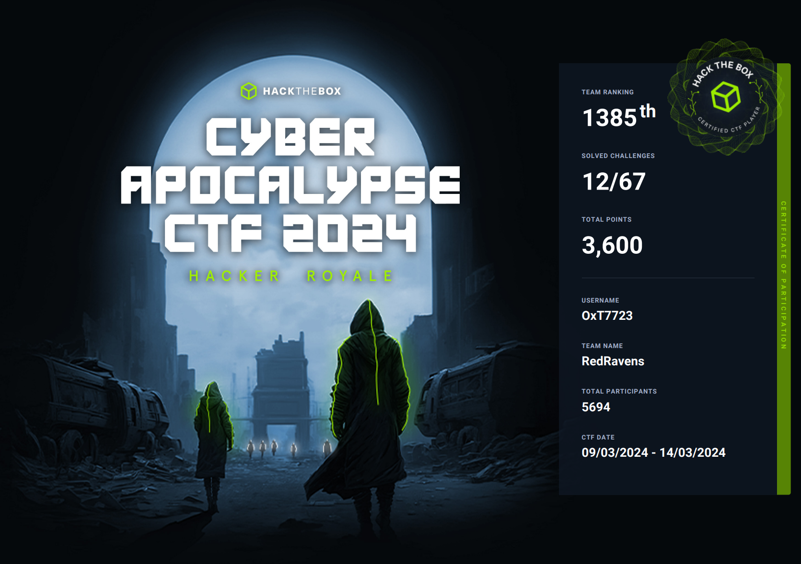

# HTB Cyber Apocalypse CTF 2024 | Hacker Royale 

9th - 13th March, 2024
Cyber Apocalypse returns with a vengeance! Join the biggest hacking competition of the year

| Title | Category | Difficulty | Solved | Writeup |
| --- | --- | --- | --- | --- |
| [Ledger Heist](Blockchain/Ledger%20Heist/readme.md) | Blockchain | hard |  |  |
| [Lucky Faucet](Blockchain/Lucky%20Faucet/readme.md) | Blockchain | easy |  |  |
| [Recovery](Blockchain/Recovery/readme.md) | Blockchain | easy |  |  |
| [Russian Roulette](Blockchain/Russian%20Roulette/readme.md) | Blockchain | very easy |  |  |
| [Arranged](Crypto/Arranged/readme.md) | Crypto | medium |  |  |
| [Blunt](Crypto/Blunt/readme.md) | Crypto | easy |  |  |
| [Dynastic](Crypto/Dynastic/readme.md) | Crypto | very easy | :heavy_check_mark: | :heavy_check_mark: |
| [Iced TEA](Crypto/Iced%20TEA/readme.md) | Crypto | easy |  |  |
| [Makeshift](Crypto/Makeshift/readme.md) | Crypto | very easy | :heavy_check_mark: | :heavy_check_mark: |
| [Partial Tenacity](Crypto/Partial%20Tenacity/readme.md) | Crypto | medium |  |  |
| [Permuted](Crypto/Permuted/readme.md) | Crypto | hard |  |  |
| [Primary Knowledge](Crypto/Primary%20Knowledge/readme.md) | Crypto | very easy | :heavy_check_mark: |  |
| [ROT128](Crypto/ROT128/readme.md) | Crypto | insane |  |  |
| [Tsayaki](Crypto/Tsayaki/readme.md) | Crypto | hard |  |  |
| [An unusual sighting](Forensics/An%20unusual%20sighting/readme.md) | Forensics | very easy | :heavy_check_mark: | :heavy_check_mark: |
| [Confinement](Forensics/Confinement/readme.md) | Forensics | hard |  |  |
| [Data Siege](Forensics/Data%20Siege/readme.md) | Forensics | medium |  |  |
| [Fake Boost](Forensics/Fake%20Boost/readme.md) | Forensics | easy |  |  |
| [Game Invitation](Forensics/Game%20Invitation/readme.md) | Forensics | hard |  |  |
| [It Has Begun](Forensics/It_Has_Begun/readme.md) | Forensics | very easy |  |  |
| [Oblique Final](Forensics/Oblique%20Final/readme.md) | Forensics | insane |  |  |
| [Phreaky](Forensics/Phreaky/readme.md) | Forensics | medium |  |  |
| [Pursue The Tracks](Forensics/Pursue%20The%20Tracks/readme.md) | Forensics | easy |  |  |
| [Urgent](Forensics/Urgent/readme.md) | Forensics | very easy | :heavy_check_mark: | :heavy_check_mark: |
| [BunnyPass](Hardware/BunnyPass/readme.md) | Hardware | very easy | :heavy_check_mark: | :heavy_check_mark: |
| [Flash-ing Logs](Hardware/Flash-ing%20Logs/readme.md) | Hardware | hard |  |  |
| [Maze](Hardware/Maze/readme.md) | Hardware | very easy | :heavy_check_mark: | :heavy_check_mark: |
| [Rids](Hardware/Rids/readme.md) | Hardware | easy |  |  |
| [The PROM](Hardware/The%20PROM/readme.md) | Hardware | medium |  |  |
| [Character](Misc/Character/readme.md) | Misc | very easy | :heavy_check_mark: |  |
| [Colored Squares](Misc/Colored%20Squares/readme.md) | Misc | medium |  |  |
| [Cubicle Riddle](Misc/Cubicle%20Riddle/readme.md) | Misc | easy |  |  |
| [MultiDigilingual](Misc/MultiDigilingual/readme.md) | Misc | hard |  |  |
| [Path of Survival](Misc/Path%20of%20Survival/readme.md) | Misc | hard |  |  |
| [Quantum Conundrum](Misc/Quantum%20Conundrum/readme.md) | Misc | medium |  |  |
| [Stop Drop and Roll](Misc/Stop%20Drop%20and%20Roll/readme.md) | Misc | very easy | :heavy_check_mark: |  |
| [Unbreakable](Misc/Unbreakable/readme.md) | Misc | easy |  |  |
| [Were Pickle Phreaks](Misc/Were%20Pickle%20Phreaks/readme.md) | Misc | easy |  |  |
| [Were Pickle Phreaks Revenge](Misc/Were%20Pickle%20Phreaks%20Revenge/readme.md) | Misc | medium |  |  |
| [Deathnote](Pwn/Deathnote/readme.md) | Pwn | medium |  |  |
| [Delulu](Pwn/Delulu/readme.md) | Pwn | very easy |  |  |
| [Gloater](Pwn/Gloater/readme.md) | Pwn | insane |  |  |
| [Maze of Mist](Pwn/Maze%20of%20Mist/readme.md) | Pwn | hard |  |  |
| [Oracle](Pwn/Oracle/readme.md) | Pwn | hard |  |  |
| [Pet Companion](Pwn/Pet%20Companion/readme.md) | Pwn | easy |  |  |
| [Rocket Blaster XXX](Pwn/Rocket%20Blaster%20XXX/readme.md) | Pwn | easy |  |  |
| [Sound of Silence](Pwn/Sound%20of%20Silence/readme.md) | Pwn | medium |  |  |
| [Tutorial](Pwn/Tutorial/readme.md) | Pwn | very easy | :heavy_check_mark: |  |
| [Writing on the Wall](Pwn/Writing%20on%20the%20Wall/readme.md) | Pwn | very easy |  |  |
| [BoxCutter](Reversing/BoxCutter/readme.md) | Reversing | very easy |  |  |
| [Crushing](Reversing/Crushing/readme.md) | Reversing | easy |  |  |
| [FlecksOfGold](Reversing/FlecksOfGold/readme.md) | Reversing | hard |  |  |
| [FollowThePath](Reversing/FollowThePath/readme.md) | Reversing | medium |  |  |
| [LootStash](Reversing/LootStash/readme.md) | Reversing | very easy |  |  |
| [MazeOfPower](Reversing/MazeOfPower/readme.md) | Reversing | insane |  |  |
| [Metagaming](Reversing/Metagaming/readme.md) | Reversing | hard |  |  |
| [PackedAway](Reversing/PackedAway/readme.md) | Reversing | very easy |  |  |
| [QuickScan](Reversing/QuickScan/readme.md) | Reversing | medium |  |  |
| [Apexsurvive](Web/Apexsurvive/readme.md) | Web | insane |  |  |
| [Flag Command](Web/Flag%20Command/readme.md) | Web | very easy | :heavy_check_mark: | :heavy_check_mark:  |
| [KORP Terminal](Web/KORP%20Terminal/readme.md) | Web | very easy |  |  |
| [Labyrinth Linguist](Web/Labyrinth%20Linguist/readme.md) | Web | easy |  |  |
| [LockTalk](Web/LockTalk/readme.md) | Web | medium |  |  |
| [Percetron](Web/Percetron/readme.md) | Web | hard |  |  |
| [SerialFlow](Web/SerialFlow/readme.md) | Web | medium |  |  |
| [Testimonial](Web/Testimonial/readme.md) | Web | easy |  |  |
| [TimeKORP](Web/TimeKORP/readme.md) | Web | very easy | :heavy_check_mark: |  |
  
  
