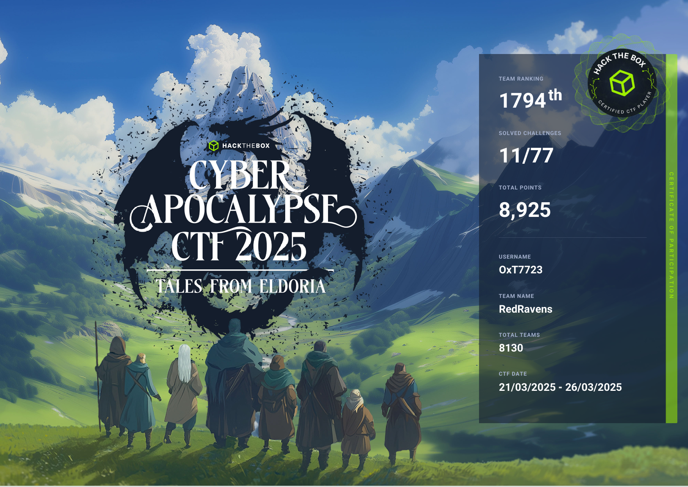

# Cyber Apocalypse CTF 2025: Tales from Eldoria

**Organization:** Hack The Box - Community

**Starts At:** 2025-03-21 9:00 am

**Ends At:** 2025-03-26 9:00 am

## Event Overview
In the ancient realm of Eldoria, a land rich with magic and steeped in legend, peace has reigned for centuries under the guidance of wise rulers and the protection of mystical creatures. Central to this harmony is the Dragon's Heart, a legendary artifact forged in the dawn of time by the dragon elders. The artifact maintains the balance between the mortal world and the realm of dragons, ensuring mutual respect and coexistence.
However, whispers of discontent echo through the mountains and forests. Lord Malakar, a once-honorable knight turned warlord, becomes obsessed with the legends of old, seeking power beyond mortal means. Consumed by ambition and driven by a prophecy foretelling a new world order under his rule, Malakar betrays his oaths and steals the Dragon's Heart from its sacred sanctuary.
With the artifact in his grasp, Malakar gains the ability to control dragons, creatures of immense power. He begins a campaign of conquest, using fear and force to bend kingdoms to his will. The skies darken with dragon wings, and flames consume villages as resistance crumbles.
Amidst the chaos, fate weaves together a diverse group of adventurers, each affected by Malakar's tyranny in personal ways. They form a fellowship bound by a common goal: to reclaim the Dragon's Heart and restore peace to Eldoria.

## Challenges

| Title | Category | Difficulty | Solved | Writeup |
| --- | --- | --- | --- | --- |
| [SealedRune](Reversing/SealedRune/README.md) | Reversing | very easy | :heavy_check_mark: | :heavy_check_mark: |
| [Mirror Witch](AI/Mirror%20Witch/README.md) | AI | easy | :heavy_check_mark: | :heavy_check_mark: |
| [Lunar Orb](AI/Lunar%20Orb/README.md) | AI | easy | :heavy_check_mark: | :heavy_check_mark: |
| [Trial by Fire](Web/Trial%20by%20Fire/README.md) | Web | very easy | :heavy_check_mark: | :heavy_check_mark: |
| [Whispers of the Moonbeam](Web/Whispers%20of%20the%20Moonbeam/README.md) | Web | very easy | :heavy_check_mark: | :heavy_check_mark: |
| [A new Hire](Forensics/A%20new%20Hire/README.md) | Forensics | very easy | :heavy_check_mark: | :heavy_check_mark: |
| [Thorin’s Amulet](Forensics/Thorins%20Amulet/README.md) | Forensics | very easy | :heavy_check_mark: | :heavy_check_mark: |
| [Summoners Incantation](Coding/Summoners%20Incantation/README.md) | Coding | very easy | :heavy_check_mark: | :heavy_check_mark: |
| [Echoes in Stone](OSINT/Echoes%20in%20Stone/README.md) | OSINT | very easy | :heavy_check_mark: | :heavy_check_mark: |
| [The Mechanical Bird's Nest](OSINT/The%20Mechanical%20Birds%20Nest/README.md) | OSINT | easy | :heavy_check_mark: | :heavy_check_mark: |
| [The Stone That Whispers](OSINT/The%20Stone%20That%20Whispers/README.md) | OSINT | very easy | :heavy_check_mark: | :heavy_check_mark: |
| Cursed GateKeeper | AI | easy |  |  |
| Elixir Emporium | AI | easy |  |  |
| Embassy | AI | easy |  |  |
| EldoriaGate | Blockchain | medium |  |  |
| Eldorion | Blockchain | very easy |  |  |
| HeliosDEX | Blockchain | easy |  |  |
| ClockWork Gurdian | Coding | very easy |  |  |
| Dragon Flight | Coding | very easy |  |  |
| Dragon Fury | Coding | very easy |  |  |
| Enchanted Cipher | Coding | very easy |  |  |
| Copperbox | Crypto | medium |  |  |
| Hourcle | Crypto | easy |  |  |
| Kewiri | Crypto | very easy |  |  |
| Prelim | Crypto | easy |  |  |
| Traces | Crypto | very easy |  |  |
| Twin Oracles | Crypto | hard |  |  |
| Verilicious | Crypto | medium |  |  |
| Cave Expedition | Forensics | medium |  |  |
| Silent Trap | Forensics | easy |  |  |
| Stealth Invasion | Forensics | easy |  |  |
| Tales for the Brave | Forensics | hard |  |  |
| ToolPie | Forensics | medium |  |  |
| Crystal Corruption | ML | medium |  |  |
| Enchanted Weights | ML | easy |  |  |
| Malakar's Deception | ML | hard |  |  |
| Reverse Prompt | ML | hard |  |  |
| Wasteland | ML | medium |  |  |
| [The Ancient Citadel](OSINT/The%20Ancient%20Citadel/README.md) | OSINT | medium |  |  |
| [The Hillside Haven](OSINT/The%20Hillside%20Haven/README.md) | OSINT | easy |  |  |
| [The Poisoned Scroll](OSINT/The%20Poisoned%20Scroll/README.md) | OSINT | medium |  |  |
| [The Shadowed Sigil](OSINT/The%20Shadowed%20Sigil/README.md) | OSINT | medium |  |  |
| Blessing | Pwn | very easy |  |  |
| Contractor | Pwn | medium |  |  |
| Crossbow | Pwn | easy |  |  |
| Laconic | Pwn | easy |  |  |
| Quack Quack | Pwn | very easy |  |  |
| Strategist | Pwn | medium |  |  |
| Vault | Pwn | hard |  |  |
| EncryptedScroll | Reversing | very easy |  |  |
| EndlessCycle | Reversing | easy |  |  |
| Gateway | Reversing | hard |  |  |
| Heart Protector | Reversing | hard |  |  |
| Impossimaze | Reversing | easy |  |  |
| Singlestep | Reversing | medium |  |  |
| Arcane Auctions | Secure Coding | easy |  |  |
| Lyra's Tavern | Secure Coding | easy |  |  |
| Stoneforge's  | Secure Coding | easy |  |  |
| Aurors Archive | Web | hard |  |  |
| Cyber Attack | Web | easy |  |  |
| Eldoria Panel | Web | medium |  |  |
| Eldoria Realms | Web | medium |  |  |

## Certificate

