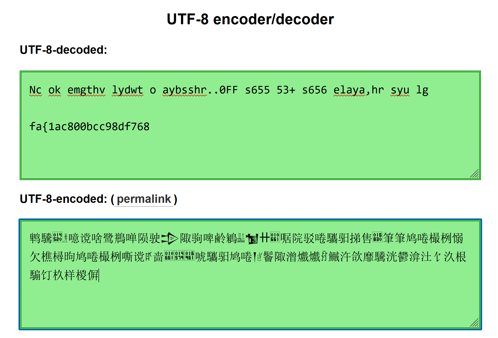

# BaseFFFF+1 - Warmup - Easy

Author: @JohnHammond

Maybe you already know about base64, but what if we took it up a notch?

Download the files below. [baseffff1](baseffff1)

## Solution 
The file contained the following string:
```
鹎驣𔔠𓁯噫谠啥鹭鵧啴陨驶𒄠陬驹啤鹷鵴𓈠𒁯ꔠ𐙡啹院驳啳驨驲挮售𖠰筆筆鸠啳樶栵愵欠樵樳昫鸠啳樶栵嘶谠ꍥ啬𐙡𔕹𖥡唬驨驲鸠啳𒁹𓁵鬠陬潧㸍㸍ꍦ鱡汻欱靡驣洸鬰渰汢饣汣根騸饤杦样椶𠌸
```

### Attempt 1: Character Code Conversion
Initially, I attempted to convert the string into character codes, which produced the following:

```
9e4e 9a63 014520 01306f 566b 8c20 5565 9e6d 9d67 5574 9668 9a76 012120 966c 9a79 5564 9e77 9d74 013220 01206f a520 010661 5579 9662 9a73 5573 9a68 9a72 632e 552e 016830 7b46 7b46 9e20 5573 6a36 6835 6135 6b20 6a35 6a33 662b 9e20 5573 6a36 6835 5636 8c20 a365 556c 010661 014579 016961 552c 9a68 9a72 9e20 5573 012079 013075 9b20 966c 6f67 3e0d 3e0d a366 9c61 6c7b 6b31 9761 9a63 6d38 9b30 6e30 6c62 9963 6c63 6839 9a38 9964 6766 6837 6936 020338
```
However, this didn’t seem to lead to a meaningful result.

### Attempt 2: UTF-8 Decoding

Next, I tried decoding the string using UTF-8 encoding, which brought me a little closer to the solution. The decoded string started to resemble a more recognizable format, but still wasn’t fully deciphered.



### Attempt 3: Base65536 Decoding

After some trial and error and exploring various encoding methods, I eventually realized that the string was encoded using base65536 (a higher base encoding than common formats like base64). Once I applied a base65536 decode, the following message was revealed:
```
Nice work! We might have played with too many bases here... 0xFFFF is 65535, 65535+1 is 65536! Well anyway, here is your flag:

flag{716abce880f09b7cdc7938eddf273648}
``` 