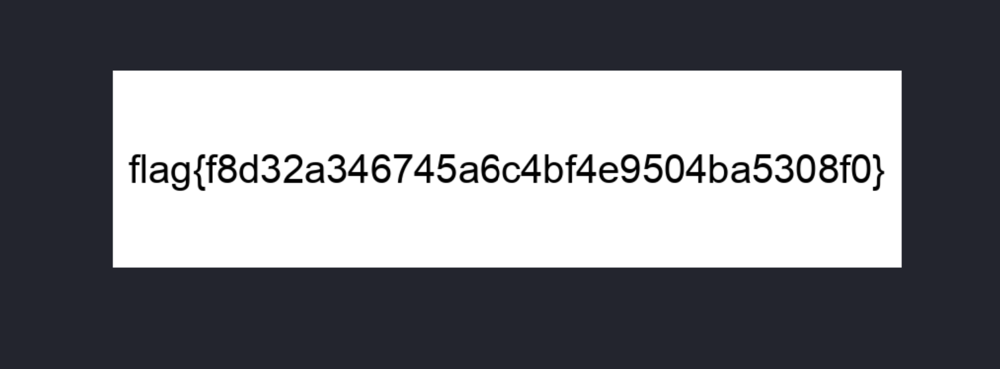

# Book By Its Cover - 50 points - Easy

Author: @JohnHammond

They say you aren't supposed to judge a book by its cover, but this is one of my favorites!

Download the file below [book.rar](book.rar)

## Solution

Downloaded the file, but I suspected it might not actually be a RAR archive.

Using the `file` commmand on the `book.rar` file revealed that it was actually a PNG image, not a RAR archive.

I changed the file extension from .rar to .png, renaming it to book.png.

Upon opening the PNG image, the flag was displayed within the image.

