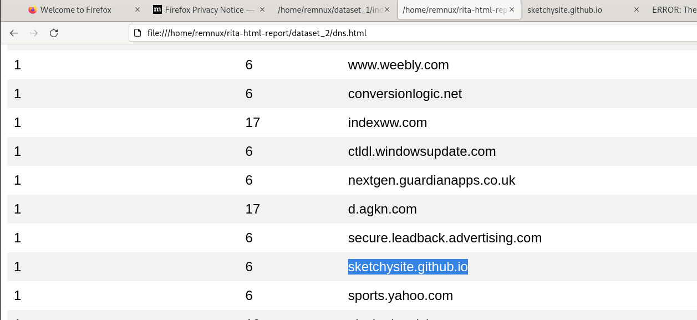
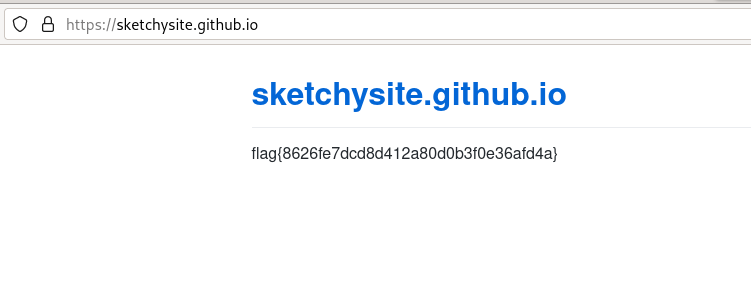

# Traffic - Forensics - medium 

**Author:** John Hammond (@JohnHammond)

We saw some communication to a sketchy site... here's an export of the network traffic. Can you track it down?

Some tools like rita or zeek might help dig through all of this data!

Download the file below: [traffic.7z](traffic.7z)

## Solution 

1. **Installation of RITA:** We installed RITA, a powerful network traffic analysis tool.

2. **Log Analysis:** Using RITA, we conducted a comprehensive analysis of the network logs.

3. **Identification of the Suspicious Site:** Through our analysis, we were able to identify the 'sketchy site' responsible for the suspicious traffic.

4. **Further Investigation:** To gather more information and potentially acquire additional evidence, we visited the suspicious site, to find the flag `flag{8626fe7dcd8d412a80d0b3f0e36afd4a}`

