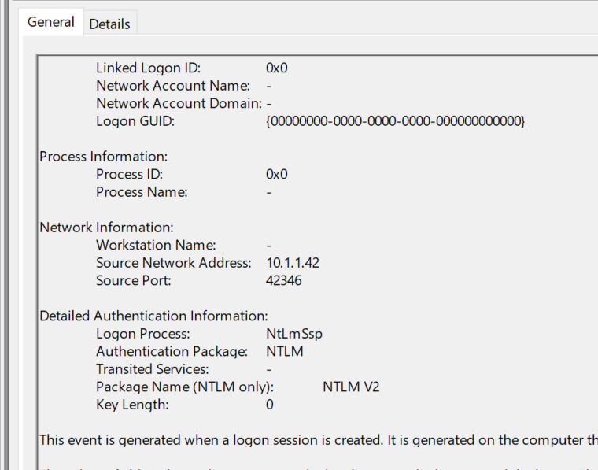
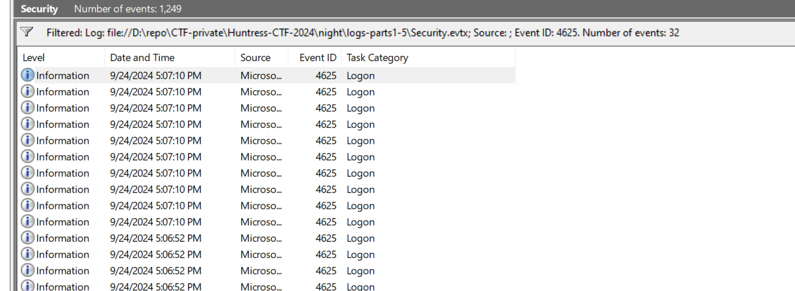
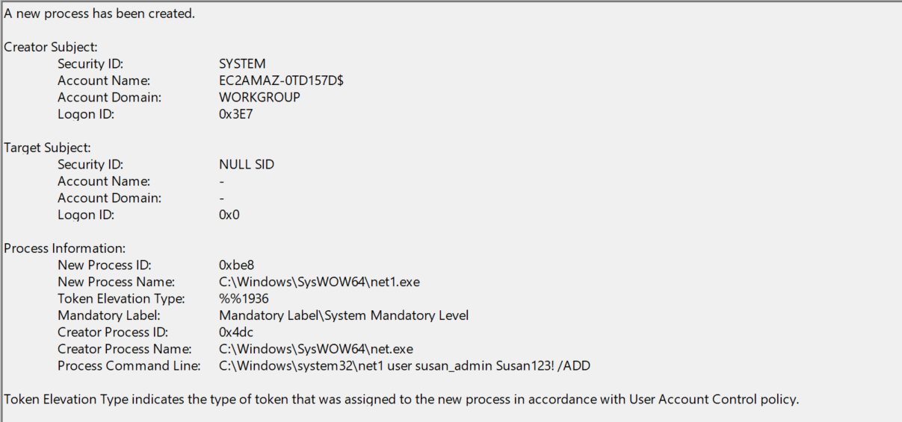

# Nightmare on Hunt Street

**Description:**

<small>Author: Austin Worline, Jose Oregon, and Adrian Garcia</small><br><br><i> DeeDee hears the screams,<br> In the logs, a chilling trace—<br> Freddy's waiting near.<br> </i> <br><br> Are you able to unravel the attack chain? The first question is:<br><br> <b>What is the IP address of the host that the attacker used?</b> <br><br> <i><b>NOTE: Flags for Part #1 to Part #5 will all be human-readable answers and in a non-standard flag format. You will use the same downloadable attachment and log files to answer all the questions.</i></b> <br><br> <b>Download the file(s) below.</b>


**Category:** Forensics

**Difficulty:** easy

**File:** [logs-parts1-5.zip](logs-parts1-5.zip)

## Solution Part 1

The IP address of the host used by the attacker was found to be 10.1.1.42:  


**Part 2**
<b>How many times was the compromised account brute-forced?</b> Answer just the integer value. 

## Solution Part 2 

To find this, I filtered the logs for Event ID 4625, which corresponds to failed login attempts with a total of 32.


**Part 3**
<b>What is the name of the offensive security tool that was used to gain initial access?</b> Answer in all lowercase. 

## Solution Part 3
Was determined by reviewing the logs and identifying `psexec` was used for initial access.

**Part 4**
<b>How many unique enumeration commands were run with <code>net.exe</code>?</b> Answer just the integer value.

## Solution Part 4

Filtered logs revealed 5 total commands, but only 3 unique commands were identified:
```
    <Data Name="CommandLine">"C:\Windows\system32\net.exe" users</Data>	
    <Data Name="CommandLine">"C:\Windows\system32\net.exe" localgroup administrators susan_admin /ADD</Data>
    <Data Name="CommandLine">"C:\Windows\system32\net.exe" user susan_admin Susan123! /ADD</Data>
    <Data Name="CommandLine">"C:\Windows\system32\net.exe" user</Data>
    <Data Name="CommandLine">"C:\Windows\system32\net.exe" user susan_admin SusanIsStrong123 /ADD</Data>
```

**Part 5**
<b>What password was successfully given to the user created?</b>

## Solution Part 5
The password was found in the log entry `C:\Windows\system32\net1 user susan_admin Susan123! /ADD` for the answer of `Susan123!`


