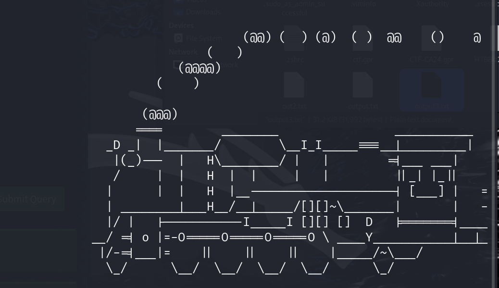
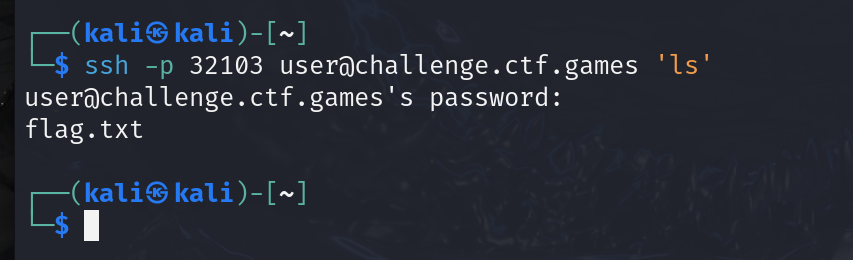
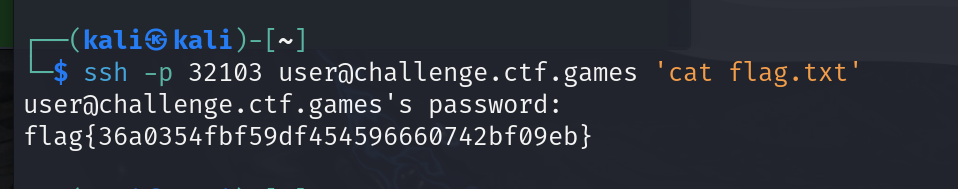

# Typo

**Description:**

<small>Author: @JohnHammond</small>  Gosh darnit, I keep entering a typo in my Linux command prompt!     <b>Press the <code>Start</code> button on the top-right to begin this challenge.</b>

**Category:** Warmups

**Difficulty:** easy

## Solution

When connecting using the provided SSH command, an ASCII art train appears on the screen.  

After researching, I discovered that the train is associated with the command `sl`, which is a common typo for the `ls` command in Linux.

I connected again using the following command, which runs ls on the server: `ssh -p 32103 user@challenge.ctf.games 'ls'`

This listed the contents of the directory, revealing a file named flag.txt.  

Retrieved the flag by running `ssh -p 32103 user@challenge.ctf.games 'cat flag.txt'`  to get a flag of  `flag{36a0354fbf59df454596660742bf09eb}`

