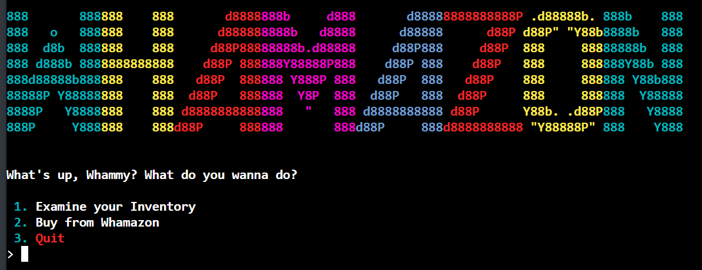
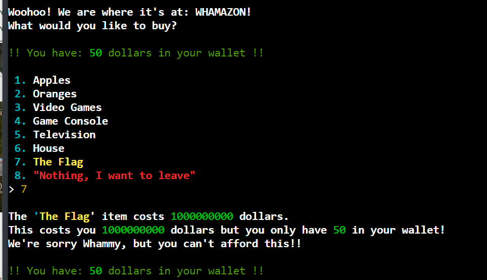
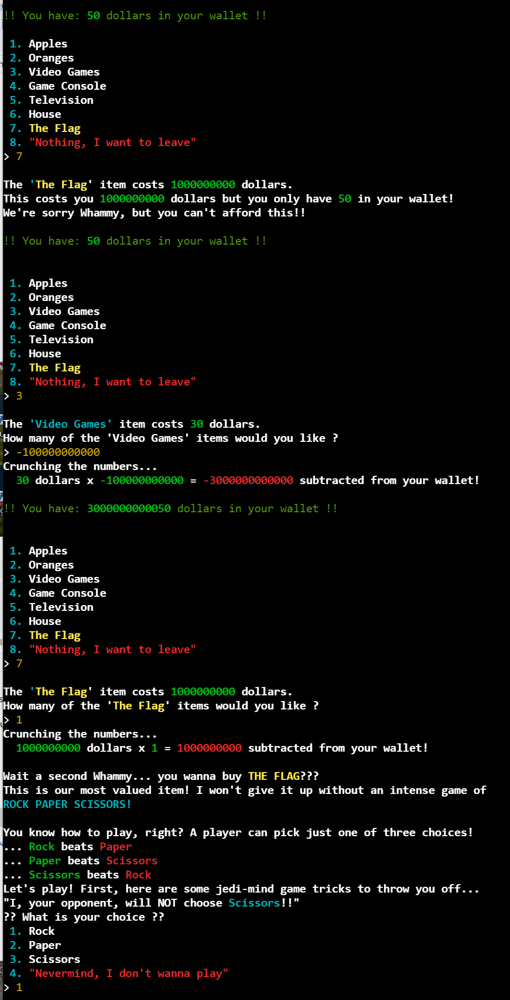
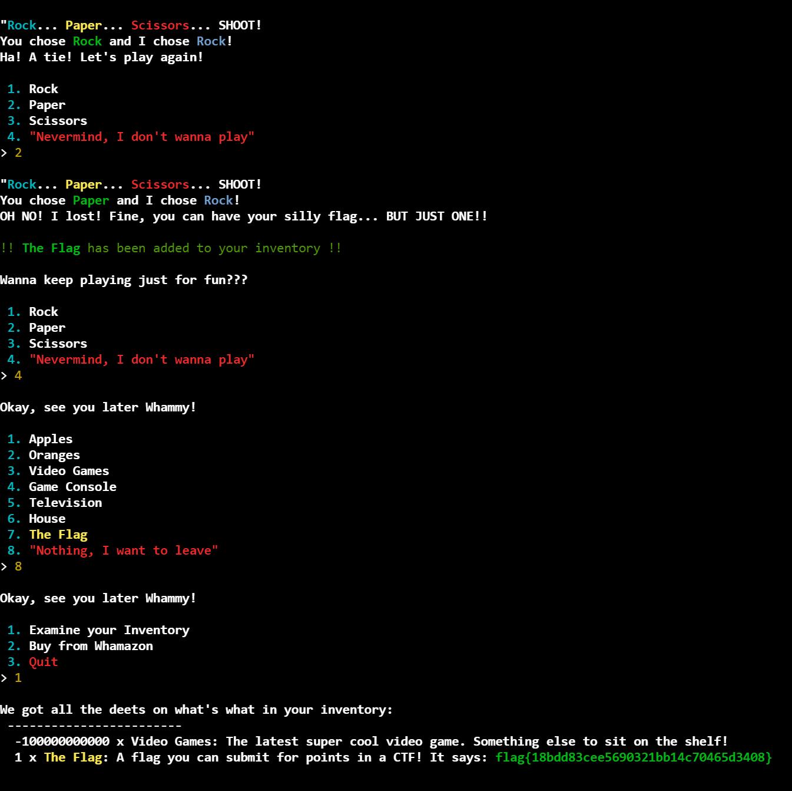

# Whamazon

**Description:**

<small>Author: @JohnHammond</small>  Wham! Bam! Amazon is entering the hacking business! Can you buy a flag?    <b>Press the <code>Start</code> button on the top-right to begin this challenge.</b>

**Category:** Warmups

**Difficulty:** easy

## Solution

I opened the provided URL to access Whamazon

After navigating to the store, I attempted to purchase the flag but discovered I didn’t have enough funds in my wallet.

To manipulate the wallet balance, I purchased -100000000000 video games. This unexpectedly resulted in my wallet balance increasing to 3,000,000,000,050 dollars. With the increased balance, I played a game of rock-paper-scissors. 

After winning, I was awarded the flag and navigated to the "Examine your Inventory" page to view and retrieve the flag: `flag{18bdd83cee5690321bb14c70465d3408}`  
