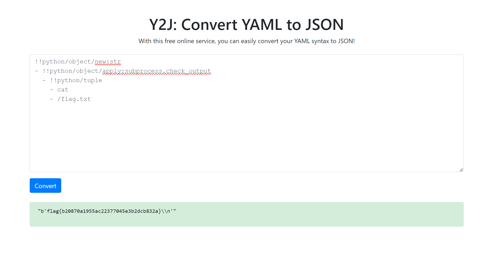

# Y2J

**Description:**

<small>Author: @JohnHammond#6971</small>  Everyone was so worried about Y2K, but apparently <i>it was a typo all along</i>!!    The real world-ending fears were from <b>Y2J</b>!    <b>Find the <code>flag.txt</code> file in the root of the filesystem.</b>    <b>Press the <code>Start</code> button on the top-right to begin this challenge.</b>

**Category:** Web

**Difficulty:** easy

## Solution

This challenge looked familiar, and after some digging, I found a similar one from the Snyk Fetch the Flag CTF 2023. It appeared to follow the same structure with minor modifications.

I searched for solutions and came across a walkthrough video by John Hammond, where he demonstrated how to solve the Snyk CTF version of this challenge. Following similar steps led me to the solution here as well.

By locating the flag.txt file at the root of the filesystem, I was able to retrieve the flag `flag{b20870a1955ac22377045e3b2dcb832a}`  
