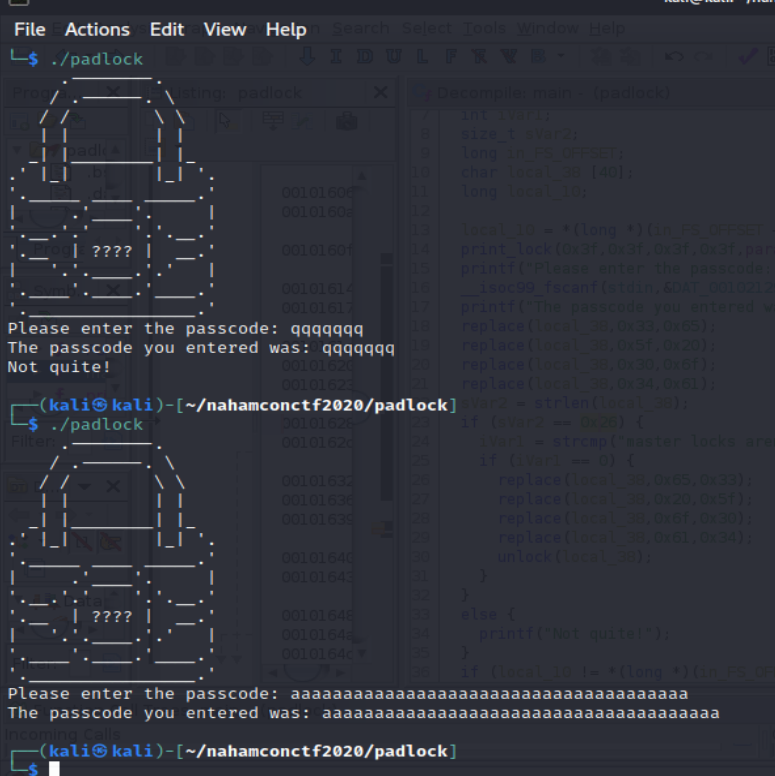
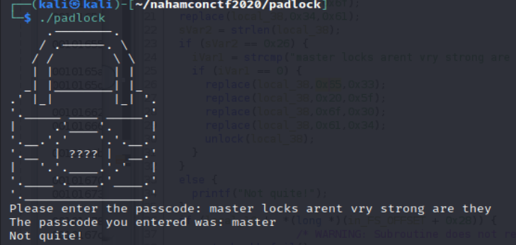

# padlock
### 50 points - Reverse Engineering - easy

<small>Author: @birch#9901</small><br><br>I forgot the combination to my pad lock :(  <br><br> <b>Download the file below. </b>
[padlock](files/padlock)

## Solution

Downloaded the file, set it to be executable with `chmod +x padlock`, and opened up Ghidra. 

downloaded padlock file
used Ghidra to disassemble the file to get this

```c

undefined8
main(undefined8 param_1,undefined8 param_2,undefined8 param_3,undefined8 param_4,undefined8 param_5,
    undefined8 param_6)

{
  int iVar1;
  size_t sVar2;
  long in_FS_OFFSET;
  char local_38 [40];
  long local_10;
  
  local_10 = *(long *)(in_FS_OFFSET + 0x28);
  print_lock(0x3f,0x3f,0x3f,0x3f,param_5,param_6,param_2);
  printf("Please enter the passcode: ");
  __isoc99_fscanf(stdin,&DAT_00102129,local_38);
  printf("The passcode you entered was: %s\n",local_38);
  replace(local_38,0x33,0x65);
  replace(local_38,0x5f,0x20);
  replace(local_38,0x30,0x6f);
  replace(local_38,0x34,0x61);
  sVar2 = strlen(local_38);
  if (sVar2 == 0x26) {
    iVar1 = strcmp("master locks arent vry strong are they",local_38);
    if (iVar1 == 0) {
      replace(local_38,0x65,0x33);
      replace(local_38,0x20,0x5f);
      replace(local_38,0x6f,0x30);
      replace(local_38,0x61,0x34);
      unlock(local_38);
    }
  }
  else {
    printf("Not quite!");
  }
  if (local_10 != *(long *)(in_FS_OFFSET + 0x28)) {
                    /* WARNING: Subroutine does not return */
    __stack_chk_fail();
  }
  return 0;
}
```

Looking over the source found that `scanf()` is putting the input into `local_38`. 
Also noticed the first four `replace`
* `replace(local_38,0x65,0x33);` replacing `3` for `e`
* `replace(local_38,0x5f,0x20);` replacing ` ` for `_`
* `replace(local_38,0x30,0x6f);` replacing `0` for `o`
* `replace(local_38,0x5f,0x20);` replacing `4` for `a`

The next line `sVar2 = strlen(local_38)` is setting sVar2 to the length of the input. Then checking if `sVar2 == 0x26`. 0x26 in decimal is 38. 

Now that I know the password is 38 characters long I want to see how the program responds to a passcode, not 38 characters and is 38 characters. 

I used `qqqqqqq` for a passcode, not 38 characters, and `aaaaaaaaaaaaaaaaaaaaaaaaaaaaaaaaaaaaaa` for the one with 38 characters. 


The first test shows `Not quite!` that matches up to the else block on the character check, while the text with 38 characters did not show that message. Directly after the if is `strcmp` to compare a hard-coded string of `master locks arent vry strong are they` to `local_38`. I tried the passcode of `master locks arent vry strong are they` but of course that didn't work. 



At the time I noticed that the output showed the passcode I entered was just `master` not the full password I put in. Going back to the replace section that would replace a space for `_` I tried the passcode of `master_locks_arent_vry_strong_are_they` to get the flag of `flag{264cec034faef71c642de1721ea26b1f}`. 

While going back over this challenge again to do this write up a few things I didn't catch the first time around. 
`scanf` is reading the input up till it finds any white space and that is why the password with spaces didn't work.
When looking at the replace section a second time the intended password was likely meant to be `m4st3r_l0cks_4r3nt_vry_str0ng_4r3_th3y` because after checking `local_38` it runs replace the opposite way. 


