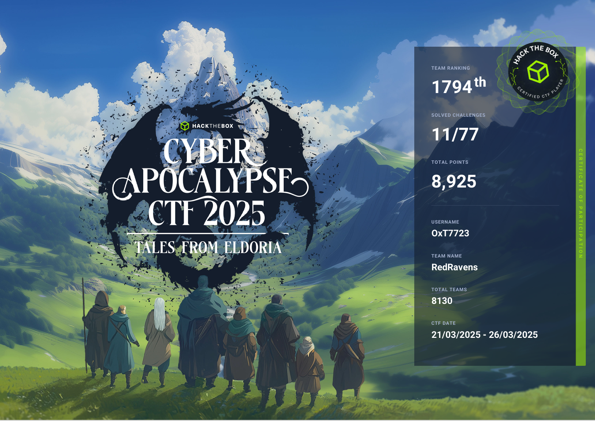
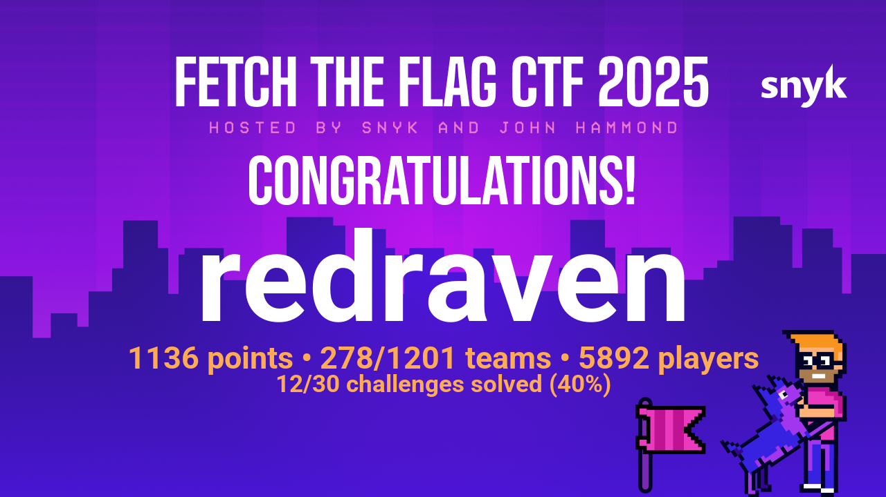
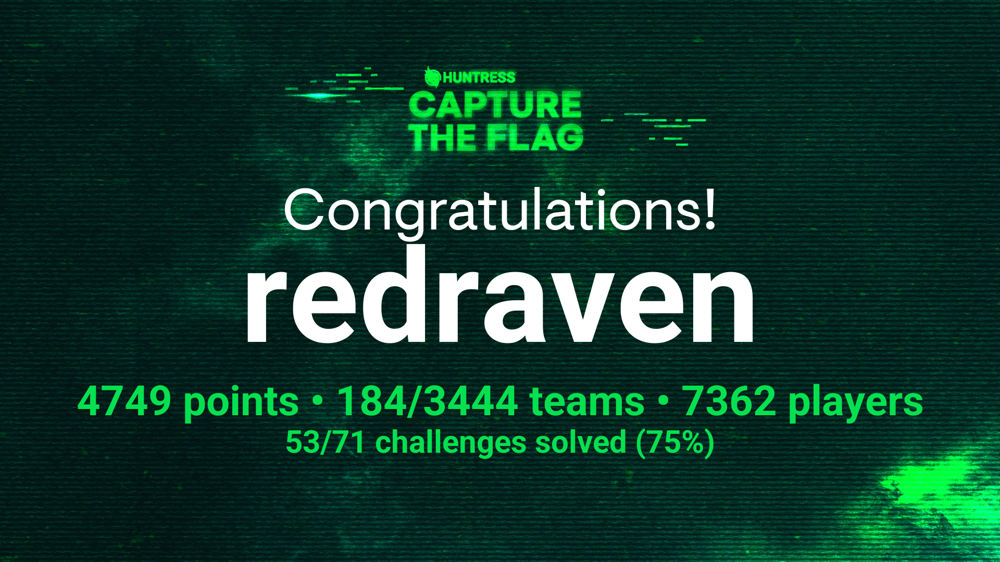
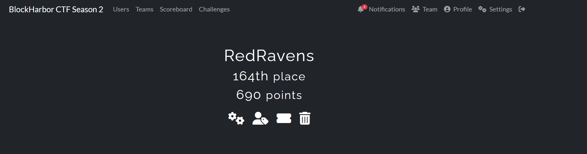
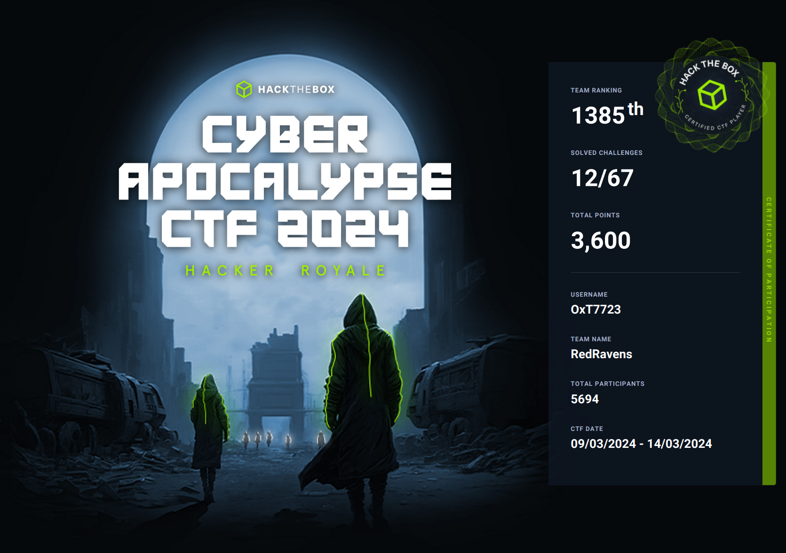
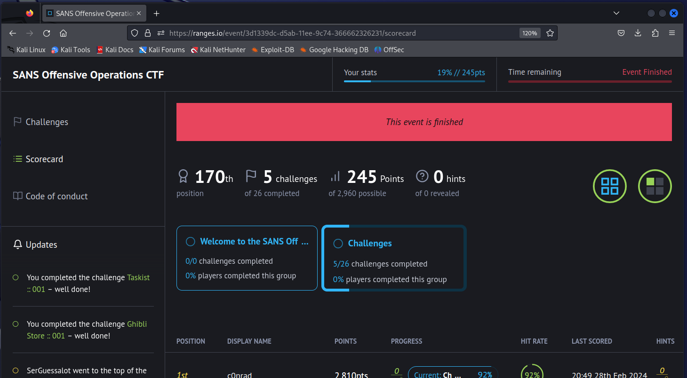
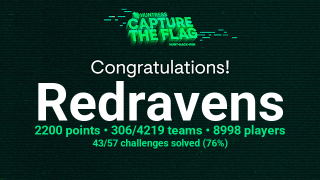
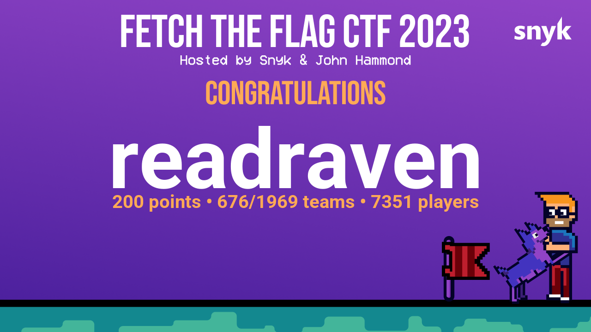
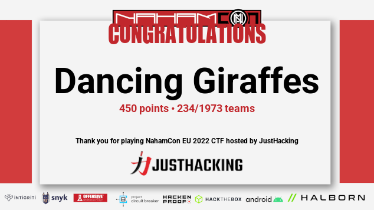

# CTFs I have participated In

| Year | Event Name | Team Name | Ranking |
| ---- | ---------- | --------- | ------- |
| 2025 | [Ghost in the source](2025/Ghost_in_the_source/readme.md) | N/A | N/A |
| 2025 | [NahamCon CTF 2025](2025/NahamConCTF/readme.md) | OwlSec | 17th of 2994 |
| 2025 | [Cyber Apocalypse CTF 2025](2025/CyberApocalypseCTF/readme.md) | Redravens | 1794th of 8130 |
| 2025 | [Snyk Fetch The Flag 2025](2025/Snyk_Fetch_The_Flag/readme.md) | Redravens | 278th of 1201 |
| 2024 | [Huntress CTF](2024/HuntressCTF/readme.md)   | Redravens | 184th of 2629 |
| 2024 | [BlockHarbor CTF Season 2 2024](2024/BlockHarbor_CTF_Season2/README.md) | RedRavens | 164th |
| 2024 | [HTB Business CTF 2024: The Vault of Hope](2024/HTBBusinessCTF/README.md) | TIAG | 424/943 |
| 2024 | [Cyber Apocalypse 2024](2024/CyberApocalypse/readme.md) | RedRavens | 1385/5694 |
| 2024 | [SANS Offensive Operations CTF](2024/SANS_Offensive_Operations_CTF/readme.md) | N/A | 170th  |
| 2023 | [Huntress CTF 2025](2023/HuntressCTF/README.md)  | Redravens | 306/4219 |
| 2023 | [Snyk Fetch the Flag](2023/Snyk_Fetch_The_Flag/readme.md) | Redravens | 676/1969 |
| 2023 | [NahamCon CTF 2023](https://github.com/OxT7723/NahamCon2023CTF) | RedRavens | 280/2518 |
| 2022 | [NahamCon EU CTF 2022](2022/NahamConCTF/README.md)  | Dancing Giraffes | 234/1973 |
| 2022 | Dark Wolf Solutions Hirining CTF Challenge |  |  |

## 2025 

### Ghost in the source (CTF)
* [writeup](2025/Ghost_in_the_source/readme.md)

### NahamCon CTF 2025

* [challenges](2025/NahamConCTF/readme.md)

### HTB Cyber Apocalypse CTF 2025

* [writeup](2025/CyberApocalypseCTF/readme.md)

### Snyk Fetch The Flag 2025

* [writeup](2025/Snyk_Fetch_The_Flag/readme.md)

## 2024 

### Huntress CTF 2024

* [writeup](2024/HuntressCTF/readme.md)

### BlockHarbor CTF Season 2 

* [writeup](2024/BlockHarbor_CTF_Season2/README.md)

### HTB Business CTF 2024: The Vault of Hope

* [writeup](2024/HTBBusinessCTF/README.md)

### HTB Cyber Apocalypse CTF 2024 

* [writeup](2024/CyberApocalypse/readme.md)

### SANS Offensive Operations CTF 2024

* [writeup](2024/SANS_Offensive_Operations_CTF/readme.md)

## 2023

### Huntress CTF 2023

* [writeup](2023/HuntressCTF/README.md)

### snyk Fetch the Flag 2023

* [writeup](2023/Snyk_Fetch_The_Flag/readme.md)

### NahamCon CTF 2023

* [writeup](https://github.com/OxT7723/NahamCon2023CTF)

# 2022

### NahamCon EU CTF 2022
The JustHacking team is ecstatic to host the next rendition of the NahamCon virtual event Capture the Flag - NahamCon EU 2022! 24 hour game, December 16th-17th, beginner-friendly but something for everyone -- like all NahamCon CTFs ;)

Official URL: https://ctf.nahamcon.com/

* [writeup](2022/NahamConCTF/README.md)

## Dark Wolf Solutions (DWS)
### HiringCTF Challenge

