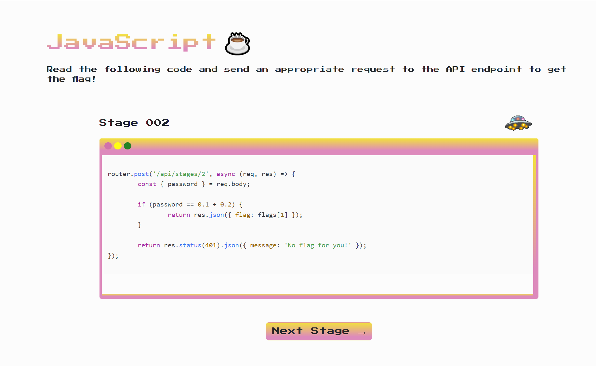

# JavaScript Stage 002 
We heard you like JavaScript? So we scrambled some nice JavaScript ☕ code for you to review! Review the provided code snippet and send appropriate API request to get the flag!

Stage 002: http://js.pwn.site:1995/stage2

## Solution 

Retrieve the following page


Much like JavaScript 001 created a request with the password to receive the flag
```
async function retrieveFlag() {
    const url = 'http://js.pwn.site:1995/api/stages/2';
    const password = 0.1 + 0.2; // Password to be sent in the request body

    try {
        const response = await fetch(url, {
            method: 'POST',
            headers: {
                'Content-Type': 'application/json'
            },
            body: JSON.stringify({ password })
        });

        if (!response.ok) {
            throw new Error('Failed to retrieve flag');
        }

        const data = await response.json();
        if (data.flag) {
            console.log('Flag:', data.flag);
        } else {
            console.log('Flag not found');
        }
    } catch (error) {
        console.error('Error:', error.message);
    }
}
```

flag `flag{IEEE-754-floating-with-you!}`

