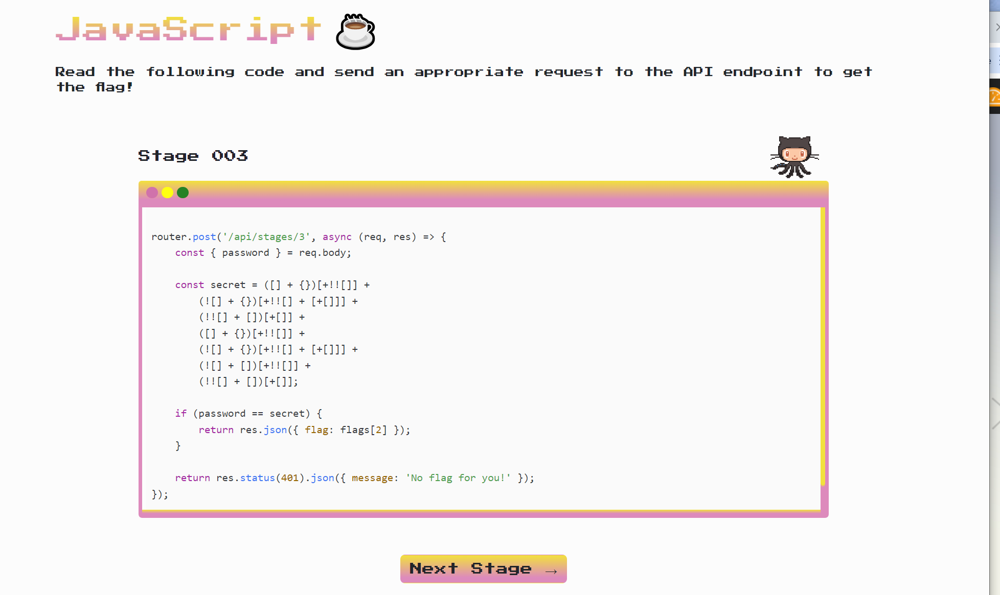

# JavaScript Stage 003

We heard you like JavaScript? So we scrambled some nice JavaScript ☕ code for you to review! Review the provided code snippet and send appropriate API request to get the flag!

Stage 003: http://js.pwn.site:1995/stage3

Retrieve the following page


```
router.post('/api/stages/3', async (req, res) => {
    const { password } = req.body;

    const secret = ([] + {})[+!![]] +
        (![] + {})[+!![] + [+[]]] +
        (!![] + [])[+[]] +
        ([] + {})[+!![]] +
        (![] + {})[+!![] + [+[]]] +
        (![] + [])[+!![]] +
        (!![] + [])[+[]];

    if (password == secret) {
        return res.json({ flag: flags[2] });
    }

    return res.status(401).json({ message: 'No flag for you!' });
});
```

Upon inspection, the secret variable resolves to `octocat`.


Utilizing the following JavaScript 

```
async function retrieveFlag() {
    const url = 'http://js.pwn.site:1995/api/stages/3';
    const password = 'octocat'; 

    try {
        const response = await fetch(url, {
            method: 'POST',
            headers: {
                'Content-Type': 'application/json'
            },
            body: JSON.stringify({ password })
        });

        if (!response.ok) {
            throw new Error('Failed to retrieve flag');
        }

        const data = await response.json();
        if (data.flag) {
            console.log('Flag:', data.flag);
        } else {
            console.log('Flag not found');
        }
    } catch (error) {
        console.error('Error:', error.message);
    }
}

retrieveFlag();
```
the flag is `flag{w31rD-j4v45cr1p7-m0m3nt!}`