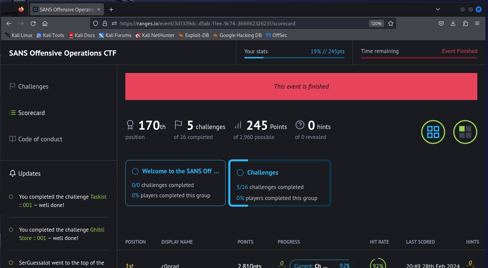

# SANS Offensive Operations CTF - Virtual Edition! 

https://www.sans.org/webcasts/offensive_operations_ctf_virtual_edition/

## Celebrate Cybersecurity Awareness Month with Huntress 

Wednesday, 28 Feb 2024 9:45AM EST to 28 Feb 2024 4:00pm EST

We’re keeping our Offensive Operations CTF for another 24 hours for anyone who wants to join! The contest has ended and support will no longer be in Discord, but we highly encourage anyone interested in jumping to play for a bit. Please relogin or create a ranges.io account and see the updated join code below.

Test your offensive capabilities against challenges based on network penetration testing, web, and binary exploitation as well as programming and other skills taught across SANS Offensive Operations.

Prerequisites:

- Players are expected to have rudimentary knowledge of the Linux and Windows operating systems
- Players should feel comfortable with computer networking
- Players are encouraged to have experience with hacking distros: Kali Linux, ParrotOS, Pentoo
- Previous CTF experience is encouraged
If you don't already have one, pease rgister for a ranges.io account here: https://ranges.io/

The join code for the event is tan-roll

Support is no longer available in the Discord, but you should still join and connect with other playing the challenges! https://sansurl.com/discord

Don’t miss this special opportunity for a FREE CTF!

## Challenges

| Title                         | Solved            | Writeup             |
| --------------------------    | ----------------- | ------------------- |
| [Ghibli Store 001](GhibliStore001/readme.md) | :heavy_check_mark: | :heavy_check_mark: |
| [JavsScript Stage 001](JavaScript-Stage001/readme.md)  | :heavy_check_mark: | :heavy_check_mark: |
| [JavsScript Stage 002](JavaScript-Stage002/readme.md)  | :heavy_check_mark: | :heavy_check_mark: |
| [JavsScript Stage 003](JavaScript-Stage003/readme.md)  | :heavy_check_mark: | :heavy_check_mark: |
| [Taskist 001](Taskist001/readme.md) | :heavy_check_mark: | :heavy_check_mark:  |
| [Taskist 002}(Taskist002/readme.md) | :heavy_check_mark: | :heavy_check_mark: |

