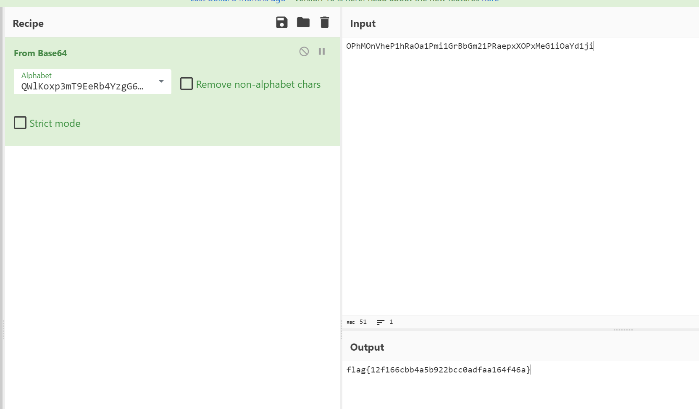

# Rusty - Warmups - easy - points 50


 <small>Author: @JohnHammond</small><br><br>We heard you were a bit rusty on the basics... so here's a small warmups challenge for you! <br><br> Here's some code attached and its output. Can you make any sense of it? <br><br> <code> OPhMOnVheP1hRaOa1Pmi1GrBbGm21PRaepxXOPxMeG1iOaYd1ji= </code> <br><br> <b>Download the file(s) below.</b>

```
use std::fs;

const CHARSET: &[u8] = b"QWlKoxp3mT9EeRb4YzgG6rNj1OLvZ5SDfMBaXtP8JyIFVH07uh2wicdnUAC#@q";

fn main() {
    let content = fs::read_to_string("flag.txt").expect("Unable to read flag.txt");

    let input = content.as_bytes();
    let mut output = Vec::new();

    let mut temp = 0u32;
    let mut temp_len = 0u8;

    for &byte in input {
        temp = (temp << 8) | byte as u32;
        temp_len += 8;

        while temp_len >= 6 {
            temp_len -= 6;
            output.push(CHARSET[((temp >> temp_len) & 0x3F) as usize]);
        }
    }

    if temp_len > 0 {
        output.push(CHARSET[((temp << (6 - temp_len)) & 0x3F) as usize]);
    }

    while output.len() % 4 != 0 {
        output.push(b'=');
    }

    let out = String::from_utf8(output).unwrap();

    println!("{}", out);
}

```

The given code is a Rust program that reads the contents of a file named flag.txt and encodes it using a custom character set defined in the CHARSET constant. The encoded output is `OPhMOnVheP1hRaOa1Pmi1GrBbGm21PRaepxXOPxMeG1iOaYd1ji=`.

The encoded output can be decoded using the same character set. 

The decoded output is flag{12f166cbb4a5b922bcc0adfaa164f46a}.