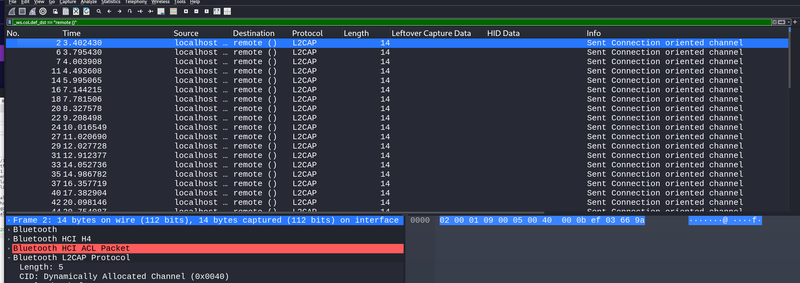

# Free Range Packets

**Description:**

<small>Author: @Soups71</small>  My friend recently has decided to stop trusting WiFi, so he decided to send me information over Bluetooth. In order to prove that you can capture data from Bluetooth without being the intended recipient, I took this packet capture with a 2 dollar bluetooth adapter.    <b>Download the file(s) below.</b>

**Category:** Forensics

**Difficulty:** easy

**File:** [freeRangePackets.pcapng](freeRangePackets.pcapng)

## Solution

I used Wireshark to inspect the captured Bluetooth traffic.

Notcied the packets with destination of remote () first one had the value of 'f' and the 2nd one had 'l' 

Noticed packets with a destination labeled as "remote", which contained individual characters in their payload.

Manually extracted the characters from each packet to get the flag of `flag{b5be72ab7e0254c056ffb57a0db124ce}`
