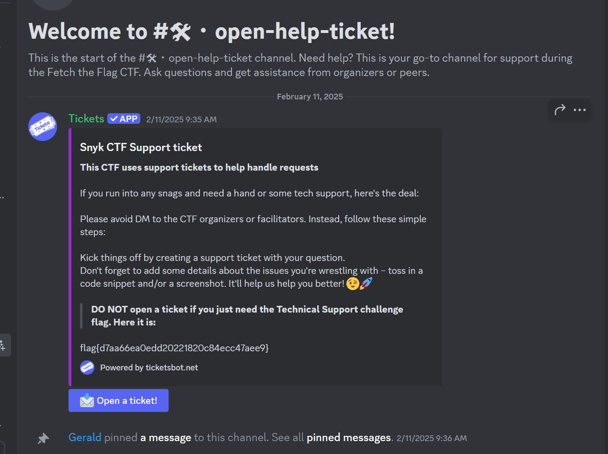

# Technical Support

**Description:**

<small>Author: @JohnHammond</small>  Want to join the party of GIFs, memes and emoji shenanigans? Or just want to ask a question  for technical support regarding any challenges in the CTF?    <b> This CTF uses <u>support tickets</u> to help handle requests.  If you need assistance, please create a ticket with the <code>#open-help-ticket</code> channel. You do not need to  direct message any CTF organizers or facilitators, they will just tell you to open a ticket. You might find a flag in the ticket channel, though!    <b>Connect here:</b>  <a href="/discord">Join the Discord!</a>

**Category:** Warmups

**Difficulty:** easy

## Solution

Solved by going to the Snyk CTF Support channel in Discord and found the flag of `flag{d7aa66ea0edd20221820c84ecc47aee9}`

