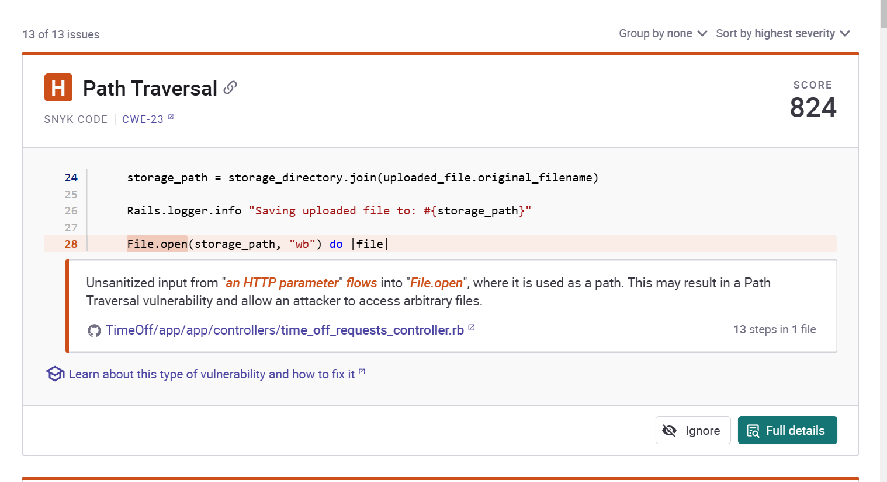
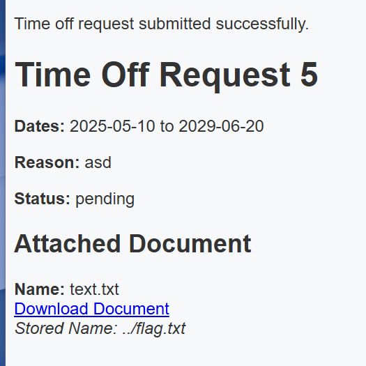
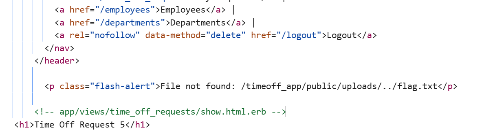

# TimeOff

**Description:**

<small>Author: @HuskyHacks</small>  TimeOff is an early build for our upcoming line of business application that will help us manage our employee's PTO requests. Please give it a thorough security test and let us know if you find anything. To set you up for success, our devs have given you the full source code and a development build of the current app. Feel free to build a local instance for your security test. If you find anything exploitable, prove it by capturing the flag.txt file on the live instance!
   The challenge source code is available in the challenge.zip folder. The password is <code>snyk-ftf-2025</code>. 
   Use the Dockerfile to run a local instance of the challenge! To build and the container, unzip the contents of the challenge.zip file and run:
  
 <code>docker build -t [challenge_name] . && docker run -it -p 3000:3000 [challenge_name]</code>
  
Credentials:
   
  <ul> 
    <li> admin@example.com:admin123
    <li> user@example.com:user123
  </ul>
    

<b>Press the <code>Start</code> button on the top-right to begin this challenge.</b>
   <small>Hint! The Snyk CLI can help you solve this challenge!</small>

**Category:** Web

**Difficulty:** easy

**File:** [challenge.zip](challenge.zip)

## Solution

Since this CTF was provided by Snyk, I started by running a Snyk security scan on the provided source code.

Snyk identified a Path Traversal vulnerability in the application’s code, specifically in the use of `File.open`.

I created a file and input the text of ../flag.txt  

Then, I attempted to download the file through the Time Off Requests page with a response of `File not found: /timeoff_app/public/uploads/../flag.txt` 

I modified the input to traverse two levels up instead with `../../flag.txt`. 

Upon downloading the file to retrieve a flag of `flag{52948d88ee74b9bdab130c35c88bd406}`

