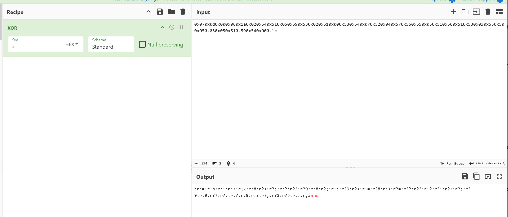
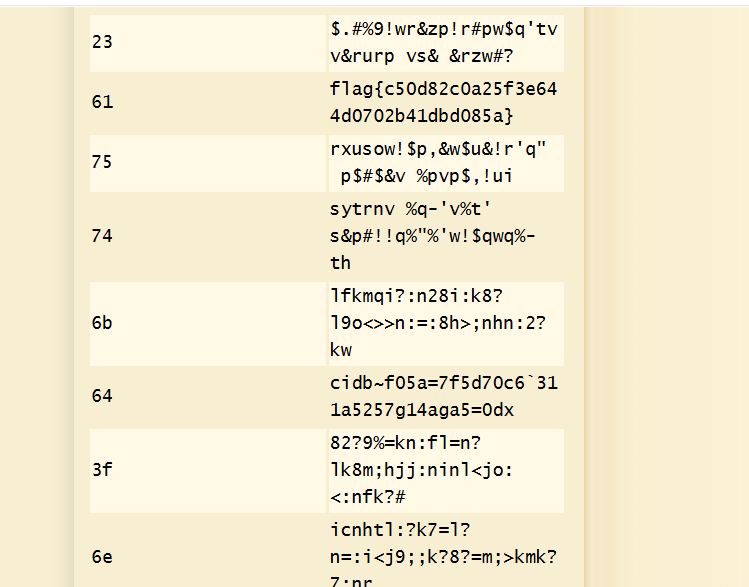

# Zero Ex Six One

**Description:**

<small>Author: @HuskyHacks</small>  I'm XORta out of ideas for how to get the flag. Does this look like anything to you?

**Category:** Warmups

**Difficulty:** easy

**File:** [flag.txt.encry](flag.txt.encry)

## Solution

1. **Inspecting the File Content**  
   Opening the file revealed the following hex-encoded string:
    `0x070x0d0x000x060x1a0x020x540x510x050x590x530x020x510x000x530x540x070x520x040x570x550x550x050x510x560x510x530x030x550x500x050x030x050x510x590x540x000x1c`

2. **Initial XOR Attempts**  
- Used **CyberChef** to apply XOR operations.  
 

3. **Finding the Correct XOR Key**  
- Tried **dcode.fr's XOR cipher tool**: [https://www.dcode.fr/xor-cipher](https://www.dcode.fr/xor-cipher)  
- Found the flag with the XOR key of 61 to get the flag of `flag{c50d82c0a25f3e644d0702b41dbd085a}`: 
    
